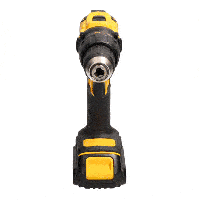
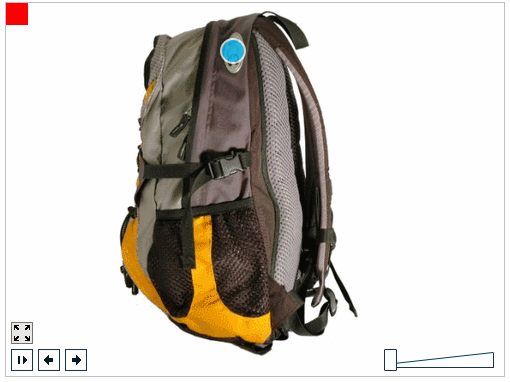
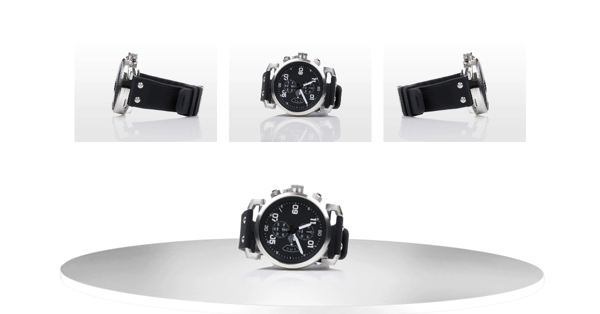

# Atividade Final

## Objetivos:

1. Consolidar os conceitos desenvolvidos durante o curso, referentes ao processo de modelagem e visualização de cenários 3D utilizando o *framework Three.js*;
2. Explorar a criatividade dos alunos na confecção de cenários 3D para uso em aplicações Web.
 
## Motivação:

Após concluir com sucesso o curso de capacitação em Web 3D, voce começou a postar nas redes sociais alguns conteúdos desenvolvidos com os conhecimentos adquiridos no curso. Além de *likes* o dono de uma cadeia de lojas de roupas e acessórios achou super interessante a possibilidade de disponibilizar os produtos em seu site, tornando a visualização de seus produtos mais interativa (atualmente o cliente pode ver apenas fotos dos produtos).

O empresário está disposto a contrata-lo para desenvolver a visualização dos seus produtos, mas para isso quer que voce apresente um protótipo como prova de conceito. 

A ideia é que o usuário possa inspecionar o produto de forma livre, e que elementos diferenciais dos produtos possam ser destacados em visões mais próximas, como mostra a Figura 1.

  

*Figura 1 - 3 exemplos de visualização de produtos.* 

## Atividade:

Construa uma página que explore o conceito de visualização de objetos tridimensionais citados acima. 

Use sua criatividade escolhendo objetos que permitam explorar bem as características do tipo de visualização. 

Selecione seus modelos do sítio *Sketfab* [5], que possui uma coleção de modelos 3D em diversas categorias. 

Alguns requisitos devem ser observados:

1. Para a visualização de produtos estes não devem poder ser movimentados. Apenas visualizados de diversos angulos e em detalhes. Tal como na Figura 1 (direita) 3 pontos de vista fixos, que destacam características do objeto, devem ser gerados; 

2. Ao menos 3 produtos devem ser visualizados. A seleção do produto pode ser feita por um componente da GUI ou mesmo através de links na página.

3. Os produtos não devem ficar flutuando no vazio, devem estar dentro de um ambiente realista, que forneça uma referencia do entorno do ambiente e da posição relativa do produto em relação a outros objetos da cena. 

## Entrega e Critérios de Avaliação:

A atividade deverá ser submetida individualmente através do repositório disponibilizado pelo professor, via *GitHub Classroom*, para essa atividade. 

> Importante: Não esqueça de colocar o diretorio *Assets* no seu projeto (tal como todos os repositórios do curso).

> **Não serão consideradas versões enviadas por e-mail, Google Classroom, Discord, ou outros meios.**

O trabalho será avaliado a partir dos seguintes critérios:

| Critério | Pontuação |
| :--- | :---: |
| 1. Carregamento dos produtos | 2,0 |
| 2. Ponto de vista adequado para a visualização dos Produtos | 2,0 |
| 3. Controle adequado das cameras  | 1,5 |
| 4. 3 pontos de vista de detalhes | 1,5 |
| 5. Uso adequado de fontes de luz | 1,0 |
| 6. Realismo do ambiente | 1,0 |
| 7. Uso adequado de sombras | 1,0 |

Use o arquivo README do repositório para uma breve descrição do cenário e informações que julgar pertinentes para a avaliação. Utilize a linguagem *markdown*. 

## Observações importantes:              

> Não presuma nada! Em caso de dúvida pergunte ao professor. 
> 
> Perguntas e dúvidas **gerais** devem ser postadas no canal do *Discord* específico. 
>
> **Dúvidas específicas** envolvendo seu código ou sua solução devem ser enviadas pelo Discord como mensagens privadas. 
>
> Mantenha sempre seu repositório atualizado para que o professor possa ter acesso ao código e ajuda-lo nas suas dúvidas.  

## Referências: 

[1] 	MARSCHNER, Steve; SHIRLEY, Peter. "**Fundamentals of Computer Graphics**". 5th Edition CRC Press, 2021.

[2]		Dirksen, J., **Learn Three.JS: Program 3D animations and visualizations for the web with JavaScript and WebGL**. 4th Edition, Packt Publishing, 2023.

[3]		Three.JS, https://threejs.org/docs/index.html.

[4] 	Reanult Space Visualization, https://renaultespace.littleworkshop.fr/.

[5] 	Sketchfab, https://sketchfab.com/feed
